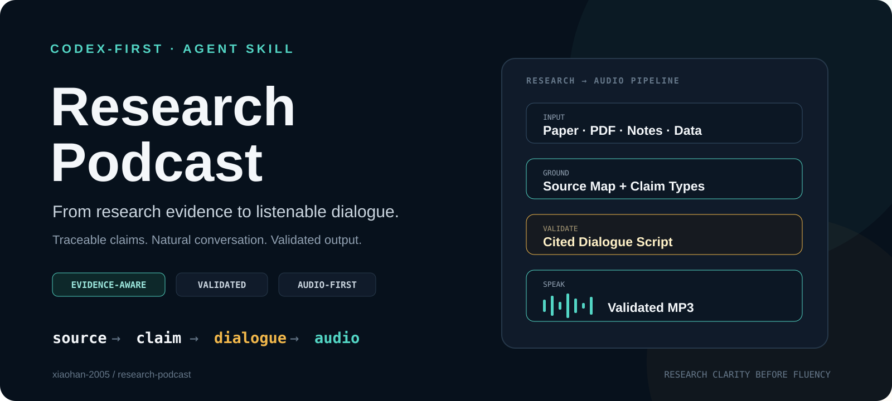

# Research Podcast

**English** · [简体中文](README.zh-CN.md)

> **Turn papers, PDFs, research notes and data into evidence-aware AI podcasts with Codex.**

[](https://github.com/xiaohan-2005/research-podcast/stargazers)
[](LICENSE)




<div align="center">

**Codex-first · evidence-aware · claim-aware · audio-first**

[**Start with the Skill**](SKILL.md) · [**Transformer case**](examples/attention-is-all-you-need/README.md) · [**Sibling project: Research Slides**](https://github.com/xiaohan-2005/research-slides)

If this workflow helps your research, revision or defense prep, **⭐ star the repository** — it helps more people discover the project.

</div>

---

## See it in action

### A real paper → a traceable podcast script

The included case turns **Vaswani et al., _Attention Is All You Need_** into a two-host research conversation.

Instead of generating a fluent summary and hoping every sentence is right, the workflow creates an explicit evidence chain first:

```text
paper
  ↓
source_map.json
  ↓
script.json with source_ids
  ↓
validate_script.py
  ↓
TTS + stitched MP3
```

A dialogue turn like this:

```text
B: Table 1 lists full self-attention with constant sequential operations
and constant maximum path length, while recurrent layers require both to
 grow linearly with sequence length. Self-attention does pay a
quadratic-in-sequence-length term in per-layer complexity, so the
comparison is a trade-off, not a claim of unconditional superiority.
```

maps directly to `S05` in the case source map.

[**Explore the full Transformer case →**](examples/attention-is-all-you-need/README.md) · [**Inspect the source map**](examples/attention-is-all-you-need/source_map.json) · [**Read the validated script**](examples/attention-is-all-you-need/script.json)

---

## The 10-second idea

Most document-to-audio workflows optimize for **fluency**.

Research Podcast adds a second requirement:

> **Evidence-bearing dialogue should remain traceable to the research source.**

```text
source  →  claim  →  dialogue  →  audio
```

That makes the workflow useful when a confident hallucination is still a bad result: research-paper reading, literature comparison, exam revision, technical briefings and defense rehearsal.

## Quick start

| | Goal | Start here |
| --- | --- | --- |
| **USE** | Run the research-to-podcast workflow | [`SKILL.md`](SKILL.md) |
| **TRY** | Inspect a real paper-to-podcast case | [`Attention Is All You Need`](examples/attention-is-all-you-need/README.md) |
| **VERIFY** | Check the evidence contract | [`validate_script.py`](scripts/validate_script.py) |
| **CUSTOMIZE** | Change hosts, language and TTS settings | [`config.example.yaml`](config/config.example.yaml) · [`PROMPT.md`](PROMPT.md) |

### Use from a local checkout

```bash
git clone https://github.com/xiaohan-2005/research-podcast.git
cd research-podcast
```

Open the repository in Codex and ask it to follow `SKILL.md`.

Example:

```text
Use the research-podcast skill in this repository.
Turn this paper into a 10-minute Chinese deep-dive podcast.
Keep every factual or interpretive claim traceable to source IDs.
Focus on the research design, strongest evidence and limitations.
```

### 30-second validation demo

```bash
python scripts/validate_script.py \
  --script examples/attention-is-all-you-need/script.json \
  --sources examples/attention-is-all-you-need/source_map.json
```

Expected output:

```text
Validation passed.
```

### Generate audio

Create a local config and set two Fish Audio voice IDs:

```bash
mkdir -p ~/.research-podcast
cp config/config.example.yaml ~/.research-podcast/config.yaml
```

Install the Python dependencies and make sure `ffmpeg` is available:

```bash
pip install -r scripts/requirements.txt
```

Then run:

```bash
python scripts/speak.py --script examples/attention-is-all-you-need/script.json
```

The TTS credential is requested through hidden terminal input at runtime and is not written into the repository. Generated episodes are stored under `~/.research-podcast/episodes/`.

---

## Four research modes

| Mode | Best for | What changes |
| --- | --- | --- |
| **deep-dive** | Paper reading, journal club | Problem → method → evidence → meaning → limitations |
| **exam-review** | Finals, concept revision | Teaching, traps, recall questions and recap |
| **defense** | Thesis, modeling, competition defense | One host explains; the other challenges assumptions and evidence |
| **briefing** | Multiple papers or reports | Cross-source synthesis, disagreements and decision-relevant evidence |

Example prompts:

```text
把这篇论文做成 deep-dive，重点讲方法、实验设计和限制。

把这一章做成 exam-review，主持人不断追问容易混淆的点。

把我的数学建模论文做成 defense，一个主持人汇报，一个像评委追问。

把这五篇论文做成 briefing，只保留真正有证据支持的共识和分歧。
```

---

## How it works

```text
Paper / PDF / Notes / Data
          ↓
Read the source completely
          ↓
Build a source map
          ↓
Separate fact / interpretation / question / transition
          ↓
Write natural two-host dialogue
          ↓
Attach source_ids to evidence-bearing turns
          ↓
Run deterministic validation
          ↓
Generate TTS segments
          ↓
Stitch + export MP3
```

The agent handles research understanding and dialogue design. Deterministic Python handles structural checks and audio assembly.

## The evidence contract

A generated conversation should sound natural **without hiding where its claims came from**.

Research Podcast therefore uses four turn types:

- **fact** — a source-reported statement; requires `source_ids`
- **interpretation** — explanation that goes beyond source wording; requires `source_ids`
- **question** — host question; may have no source ID
- **transition** — conversational glue; may have no source ID

`validate_script.py` rejects unknown source IDs and rejects evidence-bearing turns that carry no evidence reference.

This does not prove that every interpretation is scientifically correct. It makes the reasoning trail inspectable before the audio is generated.

---

## Why another research-audio tool?

This project is not trying to replace every notebook or podcast generator. It optimizes for a narrower problem: **inspectable research-to-audio workflows that an agent can run locally and that you can version in Git.**

| | Gemini Notebook (formerly NotebookLM) | [`personalized-podcast`](https://github.com/zarazhangrui/personalized-podcast) | **Research Podcast** |
| --- | --- | --- | --- |
| Primary job | Managed research notebook + generated overviews | Turn almost any content into a customizable podcast | Turn research into traceable, validated dialogue |
| Source grounding | Source-grounded product experience | Agent reads supplied content | Explicit `source_map.json` + per-turn `source_ids` |
| Validation surface | Product-managed | Podcast-generation pipeline | Local deterministic validator before TTS |
| Custom hosts / voices | Product-defined experience | Strong customization | Configurable hosts, voices, language and tone |
| Research-specific modes | General research / learning workflows | Custom prompt formats | Built-in deep-dive, exam, defense and briefing modes |
| Git inspectability | Managed product | Open-source Skill | Source map, script, rules, validator and examples are all versionable |

The point is not “better at everything.” The point is **more inspectable when evidence traceability is part of the deliverable**.

---

## Same research, different output

Research Podcast is designed as a sibling to [`research-slides`](https://github.com/xiaohan-2005/research-slides).

```text
research-slides
research → claims → evidence → presentation

research-podcast
research → claims → dialogue → audio
```

The two repositories intentionally share the same research principle:

> **Research clarity before decoration — or fluency.**

The Transformer case appears in both projects so the same evidence can be inspected across two output media.

---

## Repository structure

```text
research-podcast/
├── SKILL.md                     # Agent workflow
├── PROMPT.md                    # Dialogue behavior and style
├── QUALITY_RULES.md             # Evidence and accuracy rules
├── assets/
│   └── demo-cover.svg
├── config/
│   └── config.example.yaml
├── schemas/
│   └── podcast-script.schema.json
├── scripts/
│   ├── requirements.txt
│   ├── utils.py
│   ├── validate_script.py
│   └── speak.py
└── examples/
    ├── source.md                # Minimal synthetic smoke test
    ├── source_map.json
    ├── script.json
    └── attention-is-all-you-need/
        ├── README.md
        ├── source_map.json
        └── script.json
```

## Design philosophy

- **Reasoning belongs in the agent.** The agent reads research, resolves context and writes the dialogue.
- **Mechanical checks belong in code.** Source-ID validation and audio assembly should be deterministic.
- **Interpretation should be labeled.** A helpful explanation is not automatically a reported finding.
- **Version-sensitive evidence stays version-sensitive.** Do not silently merge numbers from different paper versions.
- **Secrets stay outside the repository.** The audio provider credential is requested at runtime.

## Requirements

- A coding agent that can follow Agent Skills / `SKILL.md` workflows
- Python 3.10+
- `ffmpeg`
- A Fish Audio account and two voice IDs for audio generation

The evidence-map and validation workflow can be used without any TTS provider.

## Roadmap

- provider abstraction beyond Fish Audio
- optional RSS publishing
- per-episode citation sheet / transcript export
- stronger semantic checks between script claims and source-map evidence
- additional real-paper cases in Chinese and English
- tighter integration with the `research-slides` evidence ledger

## Security

- Never commit provider credentials or personal source material unintentionally.
- Keep generated runs and episodes under `~/.research-podcast` rather than the Skill repository.
- Review `source_map.json` and `script.json` before publishing an episode externally.

## License

MIT. See [`LICENSE`](LICENSE).

---

Built for researchers, students and technical teams who want AI audio to be **easy to listen to and easy to audit**.
