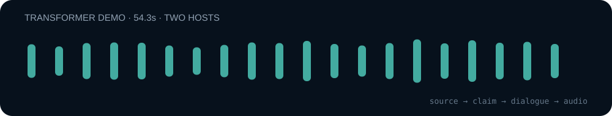

# Case Study — Attention Is All You Need

**One research paper → an evidence-aware two-host podcast script.**

This case uses *Attention Is All You Need* (Vaswani et al., 2017) to show the difference between a fluent research summary and a traceable research podcast.

The goal is not to retell the paper line by line. The goal is to preserve the paper's evidence boundary while turning the architecture, equations, trade-offs and reported results into natural dialogue.

## What is in this case

| Artifact | Purpose |
| --- | --- |
| [`source_map.json`](source_map.json) | Stable source IDs tied to sections, equations, tables and interpretations |
| [`script.json`](script.json) | Two-host dialogue where factual and interpretive turns carry `source_ids` |
| [`generate_demo.py`](generate_demo.py) | Reproducible under-a-minute local demo that needs no TTS API key |
| [`demo-waveform-54s.svg`](demo-waveform-54s.svg) | Waveform preview measured from the reproducible demo audio |
| [`../../scripts/validate_script.py`](../../scripts/validate_script.py) | Deterministic check that evidence-bearing turns point to known sources |

## Hear the idea in under a minute



The repository includes a zero-key fallback demo generator. It selects six evidence-grounded turns from the full case script and uses two local eSpeak voices so anyone can reproduce the sample without creating an account or adding a secret. On the reference run used for the waveform above, the output is **54.3 seconds**.

From the repository root:

```bash
python scripts/validate_script.py \
  --script examples/attention-is-all-you-need/script.json \
  --sources examples/attention-is-all-you-need/source_map.json
```

Expected result:

```text
Validation passed.
```

Then, on a machine with `espeak`, `ffmpeg` and the Python requirements installed:

```bash
python examples/attention-is-all-you-need/generate_demo.py
```

This writes:

```text
examples/attention-is-all-you-need/transformer-demo.mp3
```

The no-key version is deliberately a reproducibility fallback, not the target voice quality. For polished audio, configure two TTS voice IDs and run the production path:

```bash
python scripts/speak.py \
  --script examples/attention-is-all-you-need/script.json
```

The production audio layer asks for the provider credential at runtime and writes the MP3 under `~/.research-podcast/episodes/`.

## What the evidence layer changes

A generic summary can say:

> The Transformer is faster because it uses attention instead of recurrence.

This case forces a more careful version. The paper's Table 1 reports a trade-off: full self-attention has constant sequential operations and maximum path length, but its per-layer complexity contains a quadratic term in sequence length. The script therefore avoids turning a specific complexity comparison into a universal speed claim.

The same rule applies to the reported translation result. The script keeps the 28.4 BLEU result attached to the paper's WMT14 English-to-German evaluation context instead of presenting it as a context-free quality score.

## Example dialogue

```text
A: The computational trade-off is one reason this architecture mattered. What does the paper actually claim there?

B: Table 1 lists full self-attention with constant sequential operations and constant maximum path length, while recurrent layers require both to grow linearly with sequence length. Self-attention does pay a quadratic-in-sequence-length term in per-layer complexity, so the comparison is a trade-off, not a claim of unconditional superiority.
```

That answer maps to `S05` in the source map.

## Same paper, another medium

This repository is part of the same workflow family as [`research-slides`](https://github.com/xiaohan-2005/research-slides).

The sibling project uses the same paper to demonstrate:

```text
claim → source → evidence → slide
```

Research Podcast extends the idea into:

```text
source → claim → dialogue → audio
```

See the companion presentation case in [`research-slides/examples/attention-is-all-you-need`](https://github.com/xiaohan-2005/research-slides/tree/main/examples/attention-is-all-you-need).

## Source boundary

Primary source: Vaswani et al., *Attention Is All You Need* (2017), arXiv:1706.03762.

This demo intentionally avoids later-history claims about the Transformer ecosystem. If the source paper version changes, numerical claims should be re-checked before regenerating the script.
